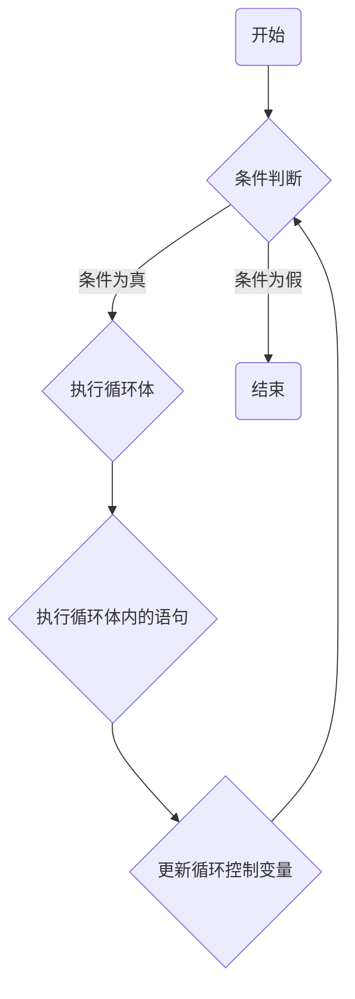

# Golang的循环

__Golang的循环区别于别的语言就是,在Glang中只有for循环一种循环结构__


#### 1.1 接下来我将用一个图片讲解关于Golang中for循环的结构





__这样我们就清晰的了解到了`for`循环的执行步骤!__:smile:


#### 1.2 接下来让我们熟悉一下`for`循环的语法吧!

> for 判断条件 {
>
> ​	循环体语句
>
> }

怎么样?是不是很简单呢?


接下来我们打印一张99乘法表吧~

```go
package main

import "fmt"

func main() {
	var i, j int

	for i = 1; i <= 9; i++ {
		for j = 1; j <= i; j++ {
			fmt.Printf("%d*%d=%d\t", i, j, i*j)
		}
		fmt.Println()
	}
}
```