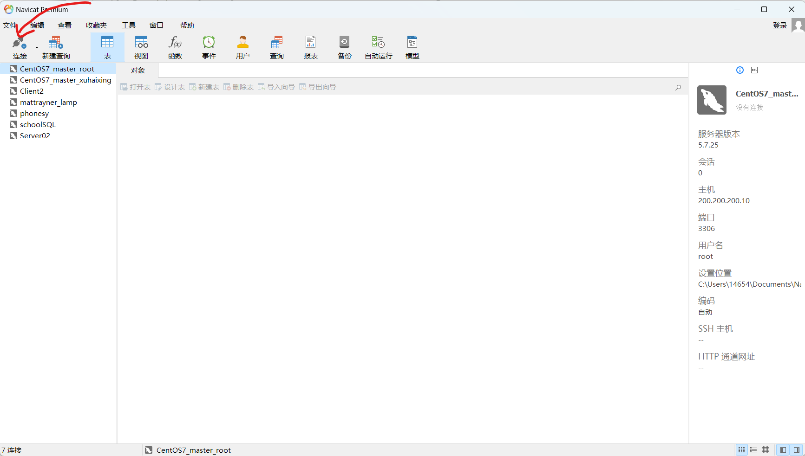
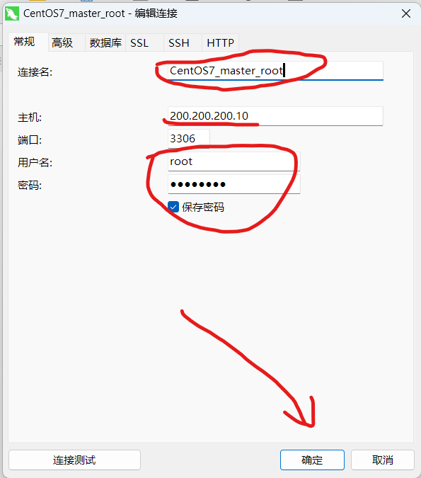
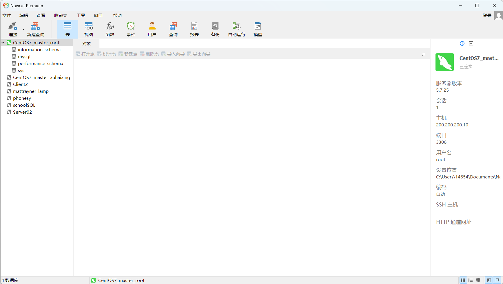

# MySQL 5.7的搭建和远程连接MySQL

1. 我们先打开文件资源管理器将压缩包`mysql-5.7.25-linux-glibc2.12-x86_64.tar.gz`移动到ftp的pub文件夹

2. 解压MySQL安装包

    ```bash
    [xuhaixing@master ~]$ sudo tar -xvf /var/ftp/pub/mysql-5.7.25-linux-glibc2.12-x86_64.tar.gz -C /usr/local/
    [sudo] password for xuhaixing:
    # 省略一些解压目录
    ```

3. 重命名

    ```bash
    [xuhaixing@master ~]$ cd /usr/local/
    [xuhaixing@master local]$ ll
    total 0
    drwxr-xr-x. 2 root root 134 Mar 18 14:53 bin
    drwxr-xr-x. 2 root root   6 Apr 11  2018 etc
    drwxr-xr-x. 2 root root   6 Apr 11  2018 games
    drwxr-xr-x. 2 root root   6 Apr 11  2018 include
    drwxr-xr-x. 3 root root  60 Mar 13 18:11 java
    drwxr-xr-x. 2 root root   6 Apr 11  2018 lib
    drwxr-xr-x. 2 root root   6 Apr 11  2018 lib64
    drwxr-xr-x. 2 root root   6 Apr 11  2018 libexec
    drwxr-xr-x. 9 root root 129 Apr  5 16:51 mysql-5.7.25-linux-glibc2.12-x86_64
    drwxr-xr-x. 3 root root  25 Mar 18 14:44 redis
    drwxr-xr-x. 2 root root   6 Apr 11  2018 sbin
    drwxr-xr-x. 5 root root  49 Mar 13 21:30 share
    drwxr-xr-x. 2 root root   6 Apr 11  2018 src
    [xuhaixing@master local]$ sudo mv mysql-5.7.25-linux-glibc2.12-x86_64 mysql
    [xuhaixing@master local]$ ll
    total 0
    drwxr-xr-x. 2 root root 134 Mar 18 14:53 bin
    drwxr-xr-x. 2 root root   6 Apr 11  2018 etc
    drwxr-xr-x. 2 root root   6 Apr 11  2018 games
    drwxr-xr-x. 2 root root   6 Apr 11  2018 include
    drwxr-xr-x. 3 root root  60 Mar 13 18:11 java
    drwxr-xr-x. 2 root root   6 Apr 11  2018 lib
    drwxr-xr-x. 2 root root   6 Apr 11  2018 lib64
    drwxr-xr-x. 2 root root   6 Apr 11  2018 libexec
    drwxr-xr-x. 9 root root 129 Apr  5 16:51 mysql
    drwxr-xr-x. 3 root root  25 Mar 18 14:44 redis
    drwxr-xr-x. 2 root root   6 Apr 11  2018 sbin
    drwxr-xr-x. 5 root root  49 Mar 13 21:30 share
    drwxr-xr-x. 2 root root   6 Apr 11  2018 src
    ```

4. 创建用户并修改用户组

    ```bash
    [xuhaixing@master local]$ sudo groupadd mysql
    [xuhaixing@master local]$ sudo useradd -r -g mysql mysql
    ```

5. 创建目录并授权

    ```bash
    [xuhaixing@master local]$ sudo mkdir -p /data/mysql
    [xuhaixing@master local]$ sudo chown -R mysql:mysql /data/mysql
    ```

6. 配置my.cnf

    ```bash
    [xuhaixing@master local]$ sudo vim /etc/my.cnf
    ```

    ```tex
    [mysqld]
    bind-address=0.0.0.0
    port=3306
    user=mysql
    basedir=/usr/local/mysql
    datadir=/data/mysql
    socket=/tmp/mysql.sock
    log-error=/data/mysql/mysql.err
    pid-file=/data/mysql/mysql.pid
    # character config
    character_set_server=utf8mb4
    symbolic-links=0
    explicit_defaults_for_timestamp=true
    ```

7. 初始化MySQL数据库

    ```bash
    [xuhaixing@master local]$ cd mysql/bin/
    [xuhaixing@master bin]$ sudo ./mysqld --defaults-file=/etc/my.cnf --basedir=/usr/local/mysql/ --datadir=/data/mysql/ --user=mysql --initialize
    ```

8. 查看MySQL的root初始密码

    ```bash
    [xuhaixing@master bin]$ sudo cat /data/mysql/mysql.err
    2024-04-05T09:23:23.755725Z 0 [Warning] InnoDB: New log files created, LSN=45790
    2024-04-05T09:23:23.778951Z 0 [Warning] InnoDB: Creating foreign key constraint system tables.
    2024-04-05T09:23:23.848838Z 0 [Warning] No existing UUID has been found, so we assume that this is the first time that this server has been started. Generating a new UUID: 26b4bcab-f32e-11ee-83c6-000c29ad7d05.
    2024-04-05T09:23:23.855097Z 0 [Warning] Gtid table is not ready to be used. Table 'mysql.gtid_executed' cannot be opened.
    2024-04-05T09:23:23.855608Z 1 [Note] A temporary password is generated for root@localhost: #2mfijDMtRRY # 密码在这
    ```

    由此可见我这里自动生成的密码为`#2mfijDMtRRY`

9. 启动MySQL并更改root密码

    ```bash
    [xuhaixing@master bin]$ sudo cp /usr/local/mysql/support-files/mysql.server /etc/init.d/mysql
    [xuhaixing@master bin]$ sudo service mysql start
    Starting MySQL. SUCCESS!
    [xuhaixing@master bin]$ ps -ef|grep mysql
    root       7315      1  0 17:27 pts/0    00:00:00 /bin/sh /usr/local/mysql/bin/mysqld_safe --datadir=/data/mysql --pid-file=/data/mysql/mysql.pid
    mysql      7542   7315  1 17:27 pts/0    00:00:00 /usr/local/mysql/bin/mysqld --basedir=/usr/local/mysql --datadir=/data/mysql --plugin-dir=/usr/local/mysql/lib/plugin --user=mysql --log-error=/data/mysql/mysql.err --pid-file=/data/mysql/mysql.pid --socket=/tmp/mysql.sock --port=3306
    xuhaixi+   7572   6981  0 17:27 pts/0    00:00:00 grep --color=auto mysql
    ```

10. 配置MySQL环境变量

    ```bash
    [xuhaixing@master bin]$ sudo vim /etc/profile
    
    [xuhaixing@master bin]$ source /etc/profile
    ```

    ```sh
    export JAVA_HOME=/usr/local/java/jdk1.8.0_212
    export MYSQL_HOME=/usr/local/mysql
    export PATH=${JAVA_HOME}/bin:${MYSQL_HOME}/bin:$PATH
    ```

11. 登录MySQL并更改root密码给予远程连接权限

    ```mysql
    [xuhaixing@master bin]$ mysql -uroot -p
    Enter password:
    Welcome to the MySQL monitor.  Commands end with ; or \g.
    Your MySQL connection id is 2
    Server version: 5.7.25
    
    Copyright (c) 2000, 2019, Oracle and/or its affiliates. All rights reserved.
    
    Oracle is a registered trademark of Oracle Corporation and/or its
    affiliates. Other names may be trademarks of their respective
    owners.
    
    Type 'help;' or '\h' for help. Type '\c' to clear the current input statement.
    
    mysql> SET PASSWORD = PASSWORD('123456');
    Query OK, 0 rows affected, 1 warning (0.00 sec)
    
    mysql> ALTER USER 'root'@'localhost' PASSWORD EXPIRE NEVER;
    Query OK, 0 rows affected (0.00 sec)
    
    mysql> FLUSH PRIVILEGES;
    Query OK, 0 rows affected (0.00 sec)
    
    mysql> use mysql
    Reading table information for completion of table and column names
    You can turn off this feature to get a quicker startup with -A
    
    Database changed
    mysql> update user set host = '%' where user = 'root';
    Query OK, 1 row affected (0.00 sec)
    Rows matched: 1  Changed: 1  Warnings: 0
    
    mysql> FLUSH PRIVILEGES;
    Query OK, 0 rows affected (0.00 sec)
    ```

12. 远程连接MySQL

    - 打开navcat

        

        

        

这样我们就连接成功啦！

13. 创建一个新用户`<xuhaixing>`，并授权

    ```mysql
    mysql> GRANT ALL PRIVILEGES ON *.* TO 'xuhaixing'@'%' IDENTIFIED BY '123456';
    Query OK, 0 rows affected, 1 warning (0.00 sec)
    
    mysql> FLUSH PRIVILEGES;
    Query OK, 0 rows affected (0.00 sec)
    ```

    和上面的步骤一样，用`xuhaixing`远程连接MySQL

    

<hr />

这样我们的MySQL就搭建好啦！你们呢？:happy: