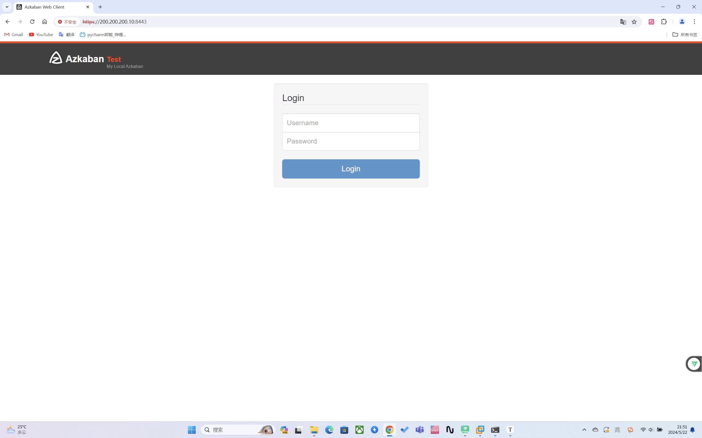

# azkaban的安装与搭建

## ‼️重要通知

​	由于国内网络环境问题，为了能更好的观看文档，我更改了仓库地址到`gitee`解决了由于网络问题导致无法加载文档中图片的问题

<mark>我的文档仓库地址：</mark>

> https://gitee.com/haix1ng/LearnToCode

[TOC]

<hr />

## 什么是azkaban？

​	Azkaban是由Linkedin公司推出的一个批量工作流任务调度器，主要用于在一个工作流内以一个特定的顺序运行一组工作和流程，它的配置是通过简单的key:value对的方式，通过配置中的Dependencies 来设置依赖关系。Azkaban使用job配置文件建立任务之间的依赖关系，并提供一个易于使用的web用户界面维护和跟踪你的工作流。

### 搭建前期准备

​	在搭建azkaban之前我们先准备几个压缩包

- `azkaban-executor-server-2.5.0.tar.gz`
- `azkaban-sql-script-2.5.0.tar.gz`
- `azkaban-web-server-2.5.0.tar.gz`

相信大家的对`ftp`的使用以及很熟练了，那么请将这三个压缩包丢入`ftp`的`pub`文件夹。

<hr />

## 开始搭建

```bash
[xuhaixing@master ~]$ mkdir /opt/software/azkaban
[xuhaixing@master ~]$ sudo tar -xvf /var/ftp/pub/azkaban-executor-server-2.5.0.tar.gz -C /opt/software/azkaban/
# 省略解压的内容
[xuhaixing@master ~]$ sudo tar -xvf /var/ftp/pub/azkaban-sql-script-2.5.0.tar.gz -C /opt/softwa
re/azkaban/
# 省略解压的内容
[xuhaixing@master ~]$ sudo tar -xvf /var/ftp/pub/azkaban-web-server-2.5.0.tar.gz -C /opt/softwa
re/azkaban/
# 省略解压的内容
[xuhaixing@master ~]$ sudo chown -R xuhaixing:xuhaixing /opt/software/azkaban/
[sudo] password for xuhaixing:
[xuhaixing@master ~]$ mv /opt/software/azkaban/azkaban-executor-2.5.0 /opt/software/azkaban/azkaban-executor
[xuhaixing@master ~]$ mv /opt/software/azkaban/azkaban-2.5.0 /opt/software/azkaban/azkaban-sql
[xuhaixing@master ~]$ mv /opt/software/azkaban/azkaban-web-2.5.0 /opt/software/azkaban/azkaban-
web
```

## 创建Azkaban数据库

⚠️<mark>注意</mark>: 这里MySQL登录的用户名一定要是操作用户的(建议使用hadoop)用户名，例如我的操作用户是`xuhaixing`

```mysql
[xuhaixing@master ~]$ mysql -uxuhaixing -p123456
mysql: [Warning] Using a password on the command line interface can be insecure.
Welcome to the MySQL monitor.  Commands end with ; or \g.
Your MySQL connection id is 3802
Server version: 5.7.25 MySQL Community Server (GPL)

Copyright (c) 2000, 2019, Oracle and/or its affiliates. All rights reserved.

Oracle is a registered trademark of Oracle Corporation and/or its
affiliates. Other names may be trademarks of their respective
owners.

Type 'help;' or '\h' for help. Type '\c' to clear the current input statement.

mysql> create database azkaban;
Query OK, 1 row affected (0.00 sec)

mysql> use azkaban;
Database changed
mysql> source /opt/software/azkaban/azkaban-sql/create-all-sql-2.5.0.sql
Query OK, 0 rows affected (0.01 sec)

Query OK, 0 rows affected (0.00 sec)

Query OK, 0 rows affected (0.00 sec)

Query OK, 0 rows affected (0.01 sec)
Records: 0  Duplicates: 0  Warnings: 0

Query OK, 0 rows affected (0.00 sec)
Records: 0  Duplicates: 0  Warnings: 0

Query OK, 0 rows affected (0.01 sec)
Records: 0  Duplicates: 0  Warnings: 0

Query OK, 0 rows affected (0.00 sec)
Records: 0  Duplicates: 0  Warnings: 0

Query OK, 0 rows affected (0.00 sec)

Query OK, 0 rows affected (0.01 sec)
Records: 0  Duplicates: 0  Warnings: 0

Query OK, 0 rows affected (0.00 sec)
Records: 0  Duplicates: 0  Warnings: 0

Query OK, 0 rows affected (0.00 sec)
Records: 0  Duplicates: 0  Warnings: 0

Query OK, 0 rows affected (0.00 sec)

Query OK, 0 rows affected (0.01 sec)
Records: 0  Duplicates: 0  Warnings: 0

Query OK, 0 rows affected (0.00 sec)
Records: 0  Duplicates: 0  Warnings: 0

Query OK, 0 rows affected (0.00 sec)

Query OK, 0 rows affected (0.01 sec)
Records: 0  Duplicates: 0  Warnings: 0

Query OK, 0 rows affected (0.00 sec)

Query OK, 0 rows affected (0.00 sec)
Records: 0  Duplicates: 0  Warnings: 0

Query OK, 0 rows affected (0.00 sec)

Query OK, 0 rows affected (0.01 sec)
Records: 0  Duplicates: 0  Warnings: 0

Query OK, 0 rows affected (0.00 sec)

Query OK, 0 rows affected (0.00 sec)
Records: 0  Duplicates: 0  Warnings: 0

Query OK, 0 rows affected (0.01 sec)

Query OK, 0 rows affected (0.00 sec)
Records: 0  Duplicates: 0  Warnings: 0

Query OK, 0 rows affected (0.01 sec)

Query OK, 0 rows affected (0.00 sec)
Records: 0  Duplicates: 0  Warnings: 0

Query OK, 0 rows affected (0.00 sec)

Query OK, 0 rows affected (0.00 sec)
Records: 0  Duplicates: 0  Warnings: 0

Query OK, 0 rows affected (0.01 sec)

Query OK, 0 rows affected (0.00 sec)

Query OK, 0 rows affected (0.00 sec)
Records: 0  Duplicates: 0  Warnings: 0

Query OK, 0 rows affected (0.01 sec)

mysql> show tables;
+------------------------+
| Tables_in_azkaban      |
+------------------------+
| active_executing_flows |
| active_sla             |
| execution_flows        |
| execution_jobs         |
| execution_logs         |
| project_events         |
| project_files          |
| project_flows          |
| project_permissions    |
| project_properties     |
| project_versions       |
| projects               |
| properties             |
| schedules              |
| triggers               |
+------------------------+
15 rows in set (0.00 sec)

mysql> quit
Bye
```

<hr />

## 配置jetty服务器

```bash
[xuhaixing@master ~]$ cd /opt/software/azkaban/azkaban-web/conf/
[xuhaixing@master conf]$ ll
total 8
-rw-r--r--. 1 xuhaixing xuhaixing 1022 Apr 22  2014 azkaban.properties
-rw-r--r--. 1 xuhaixing xuhaixing  266 Apr 22  2014 azkaban-users.xml
[xuhaixing@master conf]$ keytool -keystore keystore -alias jetty -genkey -keyalg RSA
Enter keystore password: # 建议设置为123456
Re-enter new password: # 再次确认密码
What is your first and last name?
  [Unknown]:  xuhaixing
What is the name of your organizational unit?
  [Unknown]:  null
What is the name of your organization?
  [Unknown]:  null
What is the name of your City or Locality?
  [Unknown]:  nanchang
What is the name of your State or Province?
  [Unknown]:  nanchang
What is the two-letter country code for this unit?
  [Unknown]:  CN
Is CN=xuhaixing, OU=null, O=null, L=nanchang, ST=nanchang, C=CN correct?
  [no]:  yes

Enter key password for <jetty>
        (RETURN if same as keystore password): # 建议输入123456
Re-enter new password: # 再次确认

Warning:
The JKS keystore uses a proprietary format. It is recommended to migrate to PKCS12 which is an industry standard format using "keytool -importkeystore -srckeystore keystore -destkeystore keystore -deststoretype pkcs12".
```

<hr />

## 配置Azkaban Web Server

```bash
[xuhaixing@master conf]$ vim azkaban.properties
```

配置如下：

```properties
#Azkaban Personalization Settings
azkaban.name=Test
azkaban.label=My Local Azkaban
azkaban.color=#FF3601
azkaban.default.servlet.path=/index
# 必须配置绝对路径否则页面没有JS效果
web.resource.dir=/opt/software/azkaban/azkaban-web/web
# 配置时区
default.timezone.id=Asia/Shanghai

#Azkaban UserManager class
user.manager.class=azkaban.user.XmlUserManager
# 写入绝对路径，否则无法读取到文件
user.manager.xml.file=/opt/software/azkaban/azkaban-web/conf/azkaban-users.xml

#Loader for projects
executor.global.properties=conf/global.properties
azkaban.project.dir=projects
# 配置数据库信息
database.type=mysql
mysql.port=3306
# 这里写入数据库的IP地址或者hostname
mysql.host=200.200.200.10
mysql.database=azkaban
# 这里写入你刚才导入sql文件的用户和密码
mysql.user=xuhaixing
mysql.password=123456
mysql.numconnections=100

# Velocity dev mode
velocity.dev.mode=false

# Azkaban Jetty server properties.
# jetty.maxThreads=25
# jetty ssh端口
jetty.ssl.port=8443
# jetty 端口
jetty.port=8081
# 这里写入绝对路径，否则无法找到该文件
jetty.keystore=/opt/software/azkaban/azkaban-web/conf/keystore
jetty.password=123456
jetty.keypassword=123456
# 这里写入绝对路径，否则无法找到该文件
jetty.truststore=/opt/software/azkaban/azkaban-web/conf/keystore
jetty.trustpassword=123456

# Azkaban Executor settings
executor.port=12321

# mail settings
mail.sender=
mail.host=
job.failure.email=
job.success.email=

lockdown.create.projects=false

cache.directory=cache
```

配置用户：

```bash
[xuhaixing@master conf]$ vim azkaban-users.xml
```

```xml
<azkaban-users>
        <user username="azkaban" password="azkaban" roles="admin" groups="azkaban" />
        <user username="metrics" password="metrics" roles="metrics"/>
<!--这里的username填入你的hadoop操作用户-->
        <user username="xuhaixing" password="123456" roles="admin,metrics" />
        <role name="admin" permissions="ADMIN" />
        <role name="metrics" permissions="METRICS"/>
</azkaban-users>
```

## 配置Azkaban Executor Server

```bash
[xuhaixing@master conf]$ cd ../../azkaban-executor/conf/
[xuhaixing@master conf]$ ll
total 8
-rw-r--r--. 1 xuhaixing xuhaixing  55 Apr 22  2014 azkaban.private.properties
-rw-r--r--. 1 xuhaixing xuhaixing 469 Apr 22  2014 azkaban.properties
-rw-r--r--. 1 xuhaixing xuhaixing   0 Apr 22  2014 global.properties
[xuhaixing@master conf]$ vim azkaban.properties
```

配置如下：

```properties
#Azkaban
default.timezone.id=Asia/Shanghai

# Azkaban JobTypes Plugins
azkaban.jobtype.plugin.dir=plugins/jobtypes

#Loader for projects
executor.global.properties=/opt/software/azkaban/azkaban-executor/conf/global.properties
azkaban.project.dir=projects
# 主要就是配置mysql
database.type=mysql
mysql.port=3306
mysql.host=200.200.200.10
mysql.database=azkaban
mysql.user=xuhaixing
mysql.password=123456
mysql.numconnections=100

# Azkaban Executor settings
executor.maxThreads=50
executor.port=12321
executor.flow.threads=30
```

## 配置Azkaban环境变量

```bash
[xuhaixing@master ~]$ vim ~/.bash_profile
```

```sh
export HADOOP_HOME=/opt/software/hadoop/hadoop-3.3.3
export ZOOKEEPER_HOME=/opt/software/zookeeper-3.4.5
export SPARK_HOME=/opt/software/spark-3.2
export HIVE_HOME=/opt/software/hive-3.1
export HBASE_HOME=/opt/software/hbase-2.2
export AZKABAN_HOME=/opt/software/azkaban

export PATH=$HOME/.local/bin:$HOME/bin:${HADOOP_HOME}/bin:${HADOOP_HOME}/sbin:${ZOOKEEPER_HOME}/bin:${SPARK_HOME}/bin:${SPARK_HOME}/sbin:${HIVE_HOME}/bin:${HBASE_HOME}/bin:${AZKABAN_HOME}/azkaban-executor/bin:${AZKABAN_HOME}/azkaban-web/bin:$PATH

export PATH
```

```bash
[xuhaixing@master ~]$ source ~/.bash_profile
```

## 启动Azkaban Web Server

```bash
[xuhaixing@master ~]$ azkaban-web-start.sh
Using Hadoop from /opt/software/hadoop/hadoop-3.3.3
Using Hive from /opt/software/hive-3.1
/opt/software/azkaban/azkaban-web/bin/..
:/opt/software/azkaban/azkaban-web/bin/../lib/azkaban-2.5.0.jar:/opt/software/azkaban/azkaban-web/bin/../lib/commons-collections-3.2.1.jar:/opt/software/azkaban/azkaban-web/bin/../lib/commons-configuration-1.8.jar:/opt/software/azkaban/azkaban-web/bin/../lib/commons-dbcp-1.4.jar:/opt/software/azkaban/azkaban-web/bin/../lib/commons-dbutils-1.5.jar:/opt/software/azkaban/azkaban-web/bin/../lib/commons-email-1.2.jar:/opt/software/azkaban/azkaban-web/bin/../lib/commons-fileupload-1.2.1.jar:/opt/software/azkaban/azkaban-web/bin/../lib/commons-io-2.4.jar:/opt/software/azkaban/azkaban-web/bin/../lib/commons-jexl-2.1.1.jar:/opt/software/azkaban/azkaban-web/bin/../lib/commons-lang-2.6.jar:/opt/software/azkaban/azkaban-web/bin/../lib/commons-logging-1.1.1.jar:/opt/software/azkaban/azkaban-web/bin/../lib/commons-pool-1.6.jar:/opt/software/azkaban/azkaban-web/bin/../lib/guava-13.0.1.jar:/opt/software/azkaban/azkaban-web/bin/../lib/h2-1.3.170.jar:/opt/software/azkaban/azkaban-web/bin/../lib/httpclient-4.2.1.jar:/opt/software/azkaban/azkaban-web/bin/../lib/httpcore-4.2.1.jar:/opt/software/azkaban/azkaban-web/bin/../lib/jackson-core-asl-1.9.5.jar:/opt/software/azkaban/azkaban-web/bin/../lib/jackson-mapper-asl-1.9.5.jar:/opt/software/azkaban/azkaban-web/bin/../lib/jetty-6.1.26.jar:/opt/software/azkaban/azkaban-web/bin/../lib/jetty-util-6.1.26.jar:/opt/software/azkaban/azkaban-web/bin/../lib/joda-time-2.0.jar:/opt/software/azkaban/azkaban-web/bin/../lib/jopt-simple-4.3.jar:/opt/software/azkaban/azkaban-web/bin/../lib/junit-4.8.jar:/opt/software/azkaban/azkaban-web/bin/../lib/log4j-1.2.16.jar:/opt/software/azkaban/azkaban-web/bin/../lib/mail-1.4.5.jar:/opt/software/azkaban/azkaban-web/bin/../lib/mysql-connector-java-5.1.28.jar:/opt/software/azkaban/azkaban-web/bin/../lib/servlet-api-2.5.jar:/opt/software/azkaban/azkaban-web/bin/../lib/slf4j-api-1.6.1.jar:/opt/software/azkaban/azkaban-web/bin/../lib/slf4j-log4j12-1.6.4.jar:/opt/software/azkaban/azkaban-web/bin/../lib/velocity-1.7.jar:/opt/software/azkaban/azkaban-web/bin/../lib/velocity-tools-2.0.jar:/opt/software/azkaban/azkaban-web/bin/../extlib/*.jar:/opt/software/azkaban/azkaban-web/bin/../plugins/*/*.jar:/opt/software/hadoop/hadoop-3.3.3/conf:/opt/software/hadoop/hadoop-3.3.3/*:/opt/software/hive-3.1/conf:/opt/software/hive-3.1/lib/*
[xuhaixing@master ~]$ 2024/05/22 21:47:16.230 +0800 ERROR [AzkabanWebServer] [Azkaban] Starting Jetty Azkaban Executor...
2024/05/22 21:47:16.239 +0800 INFO [AzkabanServer] [Azkaban] Loading azkaban settings file from /opt/software/azkaban/azkaban-web/bin/../conf
2024/05/22 21:47:16.239 +0800 INFO [AzkabanServer] [Azkaban] Loading azkaban properties file
2024/05/22 21:47:16.245 +0800 INFO [AzkabanWebServer] [Azkaban] Setting up Jetty Https Server with port:8443 and numThreads:20
SLF4J: Class path contains multiple SLF4J bindings.
SLF4J: Found binding in [jar:file:/opt/software/azkaban/azkaban-web/lib/slf4j-log4j12-1.6.4.jar!/org/slf4j/impl/StaticLoggerBinder.class]
SLF4J: Found binding in [jar:file:/opt/software/hive-3.1/lib/log4j-slf4j-impl-2.10.0.jar!/org/slf4j/impl/StaticLoggerBinder.class]
SLF4J: See http://www.slf4j.org/codes.html#multiple_bindings for an explanation.
2024/05/22 21:47:16.261 +0800 INFO [log] [Azkaban] Logging to org.slf4j.impl.Log4jLoggerAdapter(org.mortbay.log) via org.mortbay.log.Slf4jLog
2024/05/22 21:47:16.273 +0800 INFO [AzkabanWebServer] [Azkaban] Loading user manager class azkaban.user.XmlUserManager
2024/05/22 21:47:16.288 +0800 INFO [XmlUserManager] [Azkaban] Loading user azkaban
2024/05/22 21:47:16.289 +0800 INFO [XmlUserManager] [Azkaban] Loading user metrics
2024/05/22 21:47:16.289 +0800 INFO [XmlUserManager] [Azkaban] Loading user xuhaixing
2024/05/22 21:47:16.463 +0800 INFO [ExecutorManager] [Azkaban] Cleaning old logs from execution_logs
2024/05/22 21:47:16.463 +0800 INFO [AzkabanWebServer] [Azkaban] Loading JDBC for project management
2024/05/22 21:47:16.466 +0800 INFO [ProjectManager] [Azkaban] Project version retention is set to 3
2024/05/22 21:47:16.485 +0800 INFO [ExecutorManager] [Azkaban] Cleaning old log files before 2024-02-28T21:47:16.467+08:00
2024/05/22 21:47:16.486 +0800 INFO [ExecutorManager] [Azkaban] Cleaned up 0 log entries.
2024/05/22 21:47:16.507 +0800 INFO [TriggerManager] [Azkaban] TriggerManager loaded.
2024/05/22 21:47:16.507 +0800 INFO [AzkabanWebServer] [Azkaban] Loading built-in checker and action types
2024/05/22 21:47:16.509 +0800 INFO [CheckerTypeLoader] [Azkaban] Registering checker BasicTimeChecker
2024/05/22 21:47:16.509 +0800 INFO [CheckerTypeLoader] [Azkaban] Registering checker SlaChecker
2024/05/22 21:47:16.509 +0800 INFO [CheckerTypeLoader] [Azkaban] Registering checker ExecutionChecker
2024/05/22 21:47:16.509 +0800 INFO [ActionTypeLoader] [Azkaban] Registering action ExecuteFlowAction
2024/05/22 21:47:16.509 +0800 INFO [ActionTypeLoader] [Azkaban] Registering action KillExecutionAction
2024/05/22 21:47:16.509 +0800 INFO [ActionTypeLoader] [Azkaban] Registering action AlertAction
2024/05/22 21:47:16.509 +0800 INFO [ActionTypeLoader] [Azkaban] Registering action CreateTriggerAction
2024/05/22 21:47:16.509 +0800 INFO [AzkabanWebServer] [Azkaban] Loading trigger based scheduler
2024/05/22 21:47:16.510 +0800 INFO [AzkabanWebServer] [Azkaban] Loading plug-in checker and action types
2024/05/22 21:47:16.510 +0800 ERROR [AzkabanWebServer] [Azkaban] plugin path plugins/triggers doesn't exist!
2024/05/22 21:47:16.511 +0800 INFO [AzkabanWebServer] [Azkaban] Setting timezone to Asia/Shanghai
2024/05/22 21:47:16.511 +0800 INFO [AzkabanWebServer] [Azkaban] Registering MBeans...
2024/05/22 21:47:16.515 +0800 INFO [AzkabanWebServer] [Azkaban] Bean azkaban.jmx.JmxJettyServer registered.
2024/05/22 21:47:16.516 +0800 INFO [AzkabanWebServer] [Azkaban] Bean azkaban.jmx.JmxTriggerManager registered.
2024/05/22 21:47:16.517 +0800 INFO [AzkabanWebServer] [Azkaban] Bean azkaban.jmx.JmxExecutorManager registered.
2024/05/22 21:47:16.517 +0800 INFO [AzkabanWebServer] [Azkaban] Setting up web resource dir /opt/software/azkaban/azkaban-web/web
2024/05/22 21:47:16.542 +0800 INFO [JdbcTriggerLoader] [Azkaban] Loading all triggers from db.
2024/05/22 21:47:16.554 +0800 INFO [JdbcTriggerLoader] [Azkaban] Loaded 0 triggers.
2024/05/22 21:47:16.554 +0800 INFO [log] [Azkaban] jetty-6.1.26
2024/05/22 21:47:16.652 +0800 WARN [log] [Azkaban] failed SslSocketConnector@0.0.0.0:8443: java.net.BindException: Address already in use (Bind failed)
2024/05/22 21:47:16.652 +0800 WARN [log] [Azkaban] failed Server@3e96bacf: java.net.BindException: Address already in use (Bind failed)
2024/05/22 21:47:16.652 +0800 WARN [AzkabanWebServer] [Azkaban] java.net.BindException: Address already in use (Bind failed)
Address already in use (Bind failed)
```

## 最后我们打开浏览器在地址栏输入

> https://你的虚拟机IP:8443

看到这个页面就好了



在输入框内输入刚才在`azkaban-users.xml`内添加到用户和密码登录即可

