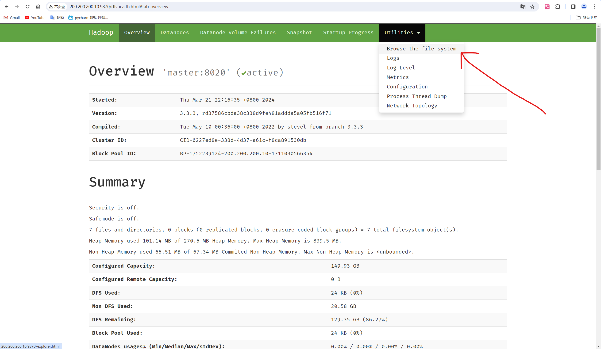

# spark的搭建

欢迎各位来到我的spark教程！

配置了`ftp`服务的同学请直接跟着我的步骤走吧！

## 1. 将spark的安装包丢入服务器

- 打开文件资源管理器，在上方地址栏输入`ftp://ip地址`将`spark-3.2.1-bin-hadoop2.7.gz`丢入pub文件夹

## 2. 开始解压spark

- 用`ssh`连接工具连接服务器

    ```bash
    [xuhaixing@master ~]$ sudo tar -xvf /var/ftp/pub/spark-3.2.1-bin-hadoop2.7.gz -C /opt/software/
    [sudo] password for xuhaixing:
    # 省略若干解压目录
    [xuhaixing@master ~]$ sudo chown -R xuhaixing:xuhaixing /opt/software/
    ```

- 重命名文件夹

    ```bash
    [xuhaixing@master ~]$ sudo chown -R xuhaixing:xuhaixing /opt/software/
    [xuhaixing@master ~]$ cd /opt/software/
    [xuhaixing@master software]$ ll
    total 4
    drwxr-xr-x.  3 xuhaixing xuhaixing   26 Mar 13 18:43 hadoop
    drwxr-xr-x. 13 xuhaixing xuhaixing  211 Jan 21  2022 spark-3.2.1-bin-hadoop2.7
    drwxr-xr-x. 11 xuhaixing xuhaixing 4096 Apr  5 15:10 zookeeper-3.4.5
    [xuhaixing@master software]$ mv spark-3.2.1-bin-hadoop2.7 spark-3.2
    [xuhaixing@master software]$ ll
    total 4
    drwxr-xr-x.  3 xuhaixing xuhaixing   26 Mar 13 18:43 hadoop
    drwxr-xr-x. 13 xuhaixing xuhaixing  211 Jan 21  2022 spark-3.2
    drwxr-xr-x. 11 xuhaixing xuhaixing 4096 Apr  5 15:10 zookeeper-3.4.5
    ```

    

## 3. 配置spark

```bash
[xuhaixing@master software]$ cd spark-3.2/
[xuhaixing@master spark-3.2]$ ll
total 128
drwxr-xr-x. 2 xuhaixing xuhaixing  4096 Jan 21  2022 bin
drwxr-xr-x. 2 xuhaixing xuhaixing   197 Jan 21  2022 conf
drwxr-xr-x. 5 xuhaixing xuhaixing    50 Jan 21  2022 data
drwxr-xr-x. 4 xuhaixing xuhaixing    29 Jan 21  2022 examples
drwxr-xr-x. 2 xuhaixing xuhaixing 12288 Jan 21  2022 jars
drwxr-xr-x. 4 xuhaixing xuhaixing    38 Jan 21  2022 kubernetes
-rw-r--r--. 1 xuhaixing xuhaixing 22878 Jan 21  2022 LICENSE
drwxr-xr-x. 2 xuhaixing xuhaixing  4096 Jan 21  2022 licenses
-rw-r--r--. 1 xuhaixing xuhaixing 57677 Jan 21  2022 NOTICE
drwxr-xr-x. 7 xuhaixing xuhaixing  4096 Jan 21  2022 python
drwxr-xr-x. 3 xuhaixing xuhaixing    17 Jan 21  2022 R
-rw-r--r--. 1 xuhaixing xuhaixing  4512 Jan 21  2022 README.md
-rw-r--r--. 1 xuhaixing xuhaixing   167 Jan 21  2022 RELEASE
drwxr-xr-x. 2 xuhaixing xuhaixing  4096 Jan 21  2022 sbin
drwxr-xr-x. 2 xuhaixing xuhaixing    42 Jan 21  2022 yarn
[xuhaixing@master spark-3.2]$ cd conf/
[xuhaixing@master conf]$ ll
total 36
-rw-r--r--. 1 xuhaixing xuhaixing 1105 Jan 21  2022 fairscheduler.xml.template
-rw-r--r--. 1 xuhaixing xuhaixing 2471 Jan 21  2022 log4j.properties.template
-rw-r--r--. 1 xuhaixing xuhaixing 9141 Jan 21  2022 metrics.properties.template
-rw-r--r--. 1 xuhaixing xuhaixing 1292 Jan 21  2022 spark-defaults.conf.template
-rwxr-xr-x. 1 xuhaixing xuhaixing 4428 Jan 21  2022 spark-env.sh.template
-rw-r--r--. 1 xuhaixing xuhaixing  865 Jan 21  2022 workers.template
[xuhaixing@master conf]$ cp workers.template workers
[xuhaixing@master conf]$ cp spark-env.sh.template spark-env.sh
[xuhaixing@master conf]$ cp spark-defaults.conf.template spark-defaults.conf
[xuhaixing@master conf]$ ll
total 52
-rw-r--r--. 1 xuhaixing xuhaixing 1105 Jan 21  2022 fairscheduler.xml.template
-rw-r--r--. 1 xuhaixing xuhaixing 2471 Jan 21  2022 log4j.properties.template
-rw-r--r--. 1 xuhaixing xuhaixing 9141 Jan 21  2022 metrics.properties.template
-rw-r--r--. 1 xuhaixing xuhaixing 1292 Apr  5 15:39 spark-defaults.conf
-rw-r--r--. 1 xuhaixing xuhaixing 1292 Jan 21  2022 spark-defaults.conf.template
-rwxr-xr-x. 1 xuhaixing xuhaixing 4428 Apr  5 15:38 spark-env.sh
-rwxr-xr-x. 1 xuhaixing xuhaixing 4428 Jan 21  2022 spark-env.sh.template
-rw-r--r--. 1 xuhaixing xuhaixing  865 Apr  5 15:38 workers
-rw-r--r--. 1 xuhaixing xuhaixing  865 Jan 21  2022 workers.template
```

我们配置一下`spark-env.sh`,添加以下配置

```sh
export JAVA_HOME=/usr/local/java/jdk1.8.0_212
export HADOOP_HOME=/opt/software/hadoop/hadoop-3.3.3
export HADOOP_CONF_DIR=/opt/software/hadoop/hadoop-3.3.3/etc/hadoop
export SPARK_MASTER_IP=master
export SPARK_MASTER_PORT=7077

export SPARK_EXECUTOR_CORES=2
export SPARK_EXECUTOR_MEMORY=1024m

export SPARK_WORKER_CORES=2
export SPARK_WORKER_MEMORY=2048m

export SPARK_WORKER_INSTANCES=1
```

配置`workers`

```sh
#
# Licensed to the Apache Software Foundation (ASF) under one or more
# contributor license agreements.  See the NOTICE file distributed with
# this work for additional information regarding copyright ownership.
# The ASF licenses this file to You under the Apache License, Version 2.0
# (the "License"); you may not use this file except in compliance with
# the License.  You may obtain a copy of the License at
#
#    http://www.apache.org/licenses/LICENSE-2.0
#
# Unless required by applicable law or agreed to in writing, software
# distributed under the License is distributed on an "AS IS" BASIS,
# WITHOUT WARRANTIES OR CONDITIONS OF ANY KIND, either express or implied.
# See the License for the specific language governing permissions and
# limitations under the License.
#

# A Spark Worker will be started on each of the machines listed below.
slave1
slave2   
```

配置`spark-defaults.conf`

```sh
#
# Licensed to the Apache Software Foundation (ASF) under one or more
# contributor license agreements.  See the NOTICE file distributed with
# this work for additional information regarding copyright ownership.
# The ASF licenses this file to You under the Apache License, Version 2.0
# (the "License"); you may not use this file except in compliance with
# the License.  You may obtain a copy of the License at
#
#    http://www.apache.org/licenses/LICENSE-2.0
#
# Unless required by applicable law or agreed to in writing, software
# distributed under the License is distributed on an "AS IS" BASIS,
# WITHOUT WARRANTIES OR CONDITIONS OF ANY KIND, either express or implied.
# See the License for the specific language governing permissions and
# limitations under the License.
#

# Default system properties included when running spark-submit.
# This is useful for setting default environmental settings.

# Example:
spark.master                            spark://master:7077
spark.eventLog.enabled                  true
spark.eventLog.dir                      hdfs://master:9000/spark-logs
spark.history.fs.logDirectory           hdfs://master:9000/spark-logs
# spark.serializer                 org.apache.spark.serializer.KryoSerializer
# spark.driver.memory              5g
# spark.executor.extraJavaOptions  -XX:+PrintGCDetails -Dkey=value -Dnumbers="one two three"
```

然后我们打开hadoop的web页面，在浏览器的网址栏输入：`ip:端口号`我这里是200.200.200.10.9870




创建`spark-logs`


## 4. 分发一下spark

```bash
[xuhaixing@master conf]$ scp -r /opt/software/spark-3.2 xuhaixing@slave1:/opt/software/
# 省略传输的目录
[xuhaixing@master conf]$ scp -r /opt/software/spark-3.2 xuhaixing@slave2:/opt/software/
# 同上
```

##  5. spark配置环境变量

```bash
[xuhaixing@master conf]$ vim ~/.bash_profile

[xuhaixing@master conf]$ source ~/.bash_profile
```

添加以下配置，slave1和slave2同理

```sh
export SPARK_HOME=/opt/software/spark-3.2
export PATH=${SPARK_HOME}/bin:${SPARK_HOME}/sbin:$PATH
```

- 为了让hadoop群启和spark群启区分，我们改几个文件

    ```bash
    [xuhaixing@master conf]$ cd ../sbin/
    [xuhaixing@master sbin]$ ll
    total 112
    -rwxr-xr-x. 1 xuhaixing xuhaixing  981 Jan 21  2022 decommission-slave.sh
    -rwxr-xr-x. 1 xuhaixing xuhaixing 2028 Jan 21  2022 decommission-worker.sh
    -rwxr-xr-x. 1 xuhaixing xuhaixing  957 Jan 21  2022 slaves.sh
    -rwxr-xr-x. 1 xuhaixing xuhaixing 1431 Jan 21  2022 spark-config.sh
    -rwxr-xr-x. 1 xuhaixing xuhaixing 6333 Jan 21  2022 spark-daemon.sh
    -rwxr-xr-x. 1 xuhaixing xuhaixing 1264 Jan 21  2022 spark-daemons.sh
    -rwxr-xr-x. 1 xuhaixing xuhaixing 1192 Jan 21  2022 start-all.sh
    -rwxr-xr-x. 1 xuhaixing xuhaixing 1764 Jan 21  2022 start-history-server.sh
    -rwxr-xr-x. 1 xuhaixing xuhaixing 2097 Jan 21  2022 start-master.sh
    -rwxr-xr-x. 1 xuhaixing xuhaixing 1877 Jan 21  2022 start-mesos-dispatcher.sh
    -rwxr-xr-x. 1 xuhaixing xuhaixing 1425 Jan 21  2022 start-mesos-shuffle-service.sh
    -rwxr-xr-x. 1 xuhaixing xuhaixing  967 Jan 21  2022 start-slave.sh
    -rwxr-xr-x. 1 xuhaixing xuhaixing  969 Jan 21  2022 start-slaves.sh
    -rwxr-xr-x. 1 xuhaixing xuhaixing 2025 Jan 21  2022 start-thriftserver.sh
    -rwxr-xr-x. 1 xuhaixing xuhaixing 3245 Jan 21  2022 start-worker.sh
    -rwxr-xr-x. 1 xuhaixing xuhaixing 1560 Jan 21  2022 start-workers.sh
    -rwxr-xr-x. 1 xuhaixing xuhaixing 1481 Jan 21  2022 stop-all.sh
    -rwxr-xr-x. 1 xuhaixing xuhaixing 1056 Jan 21  2022 stop-history-server.sh
    -rwxr-xr-x. 1 xuhaixing xuhaixing 1080 Jan 21  2022 stop-master.sh
    -rwxr-xr-x. 1 xuhaixing xuhaixing 1227 Jan 21  2022 stop-mesos-dispatcher.sh
    -rwxr-xr-x. 1 xuhaixing xuhaixing 1084 Jan 21  2022 stop-mesos-shuffle-service.sh
    -rwxr-xr-x. 1 xuhaixing xuhaixing  965 Jan 21  2022 stop-slave.sh
    -rwxr-xr-x. 1 xuhaixing xuhaixing  967 Jan 21  2022 stop-slaves.sh
    -rwxr-xr-x. 1 xuhaixing xuhaixing 1066 Jan 21  2022 stop-thriftserver.sh
    -rwxr-xr-x. 1 xuhaixing xuhaixing 1569 Jan 21  2022 stop-worker.sh
    -rwxr-xr-x. 1 xuhaixing xuhaixing 1066 Jan 21  2022 stop-workers.sh
    -rwxr-xr-x. 1 xuhaixing xuhaixing 3399 Jan 21  2022 workers.sh
    [xuhaixing@master sbin]$ mv ./stop-all.sh stop-spark-all.sh
    [xuhaixing@master sbin]$ mv ./start-all.sh start-spark-all.sh
    [xuhaixing@master sbin]$ ll
    total 112
    -rwxr-xr-x. 1 xuhaixing xuhaixing  981 Jan 21  2022 decommission-slave.sh
    -rwxr-xr-x. 1 xuhaixing xuhaixing 2028 Jan 21  2022 decommission-worker.sh
    -rwxr-xr-x. 1 xuhaixing xuhaixing  957 Jan 21  2022 slaves.sh
    -rwxr-xr-x. 1 xuhaixing xuhaixing 1431 Jan 21  2022 spark-config.sh
    -rwxr-xr-x. 1 xuhaixing xuhaixing 6333 Jan 21  2022 spark-daemon.sh
    -rwxr-xr-x. 1 xuhaixing xuhaixing 1264 Jan 21  2022 spark-daemons.sh
    -rwxr-xr-x. 1 xuhaixing xuhaixing 1764 Jan 21  2022 start-history-server.sh
    -rwxr-xr-x. 1 xuhaixing xuhaixing 2097 Jan 21  2022 start-master.sh
    -rwxr-xr-x. 1 xuhaixing xuhaixing 1877 Jan 21  2022 start-mesos-dispatcher.sh
    -rwxr-xr-x. 1 xuhaixing xuhaixing 1425 Jan 21  2022 start-mesos-shuffle-service.sh
    -rwxr-xr-x. 1 xuhaixing xuhaixing  967 Jan 21  2022 start-slave.sh
    -rwxr-xr-x. 1 xuhaixing xuhaixing  969 Jan 21  2022 start-slaves.sh
    -rwxr-xr-x. 1 xuhaixing xuhaixing 1192 Jan 21  2022 start-spark-all.sh
    -rwxr-xr-x. 1 xuhaixing xuhaixing 2025 Jan 21  2022 start-thriftserver.sh
    -rwxr-xr-x. 1 xuhaixing xuhaixing 3245 Jan 21  2022 start-worker.sh
    -rwxr-xr-x. 1 xuhaixing xuhaixing 1560 Jan 21  2022 start-workers.sh
    -rwxr-xr-x. 1 xuhaixing xuhaixing 1056 Jan 21  2022 stop-history-server.sh
    -rwxr-xr-x. 1 xuhaixing xuhaixing 1080 Jan 21  2022 stop-master.sh
    -rwxr-xr-x. 1 xuhaixing xuhaixing 1227 Jan 21  2022 stop-mesos-dispatcher.sh
    -rwxr-xr-x. 1 xuhaixing xuhaixing 1084 Jan 21  2022 stop-mesos-shuffle-service.sh
    -rwxr-xr-x. 1 xuhaixing xuhaixing  965 Jan 21  2022 stop-slave.sh
    -rwxr-xr-x. 1 xuhaixing xuhaixing  967 Jan 21  2022 stop-slaves.sh
    -rwxr-xr-x. 1 xuhaixing xuhaixing 1481 Jan 21  2022 stop-spark-all.sh
    -rwxr-xr-x. 1 xuhaixing xuhaixing 1066 Jan 21  2022 stop-thriftserver.sh
    -rwxr-xr-x. 1 xuhaixing xuhaixing 1569 Jan 21  2022 stop-worker.sh
    -rwxr-xr-x. 1 xuhaixing xuhaixing 1066 Jan 21  2022 stop-workers.sh
    -rwxr-xr-x. 1 xuhaixing xuhaixing 3399 Jan 21  2022 workers.sh
    [xuhaixing@master sbin]$ scp /opt/software/spark-3.2/sbin xuhaixing@slave1:/opt/software/spark-3.2/
    /opt/software/spark-3.2/sbin: not a regular file
    [xuhaixing@master sbin]$ scp -r /opt/software/spark-3.2/sbin xuhaixing@slave1:/opt/software/spa
    rk-3.2/
    decommission-slave.sh                                        100%  981     1.8MB/s   00:00
    decommission-worker.sh                                       100% 2028     1.1MB/s   00:00
    slaves.sh                                                    100%  957   578.5KB/s   00:00
    spark-config.sh                                              100% 1431     1.2MB/s   00:00
    spark-daemon.sh                                              100% 6333     7.0MB/s   00:00
    spark-daemons.sh                                             100% 1264     2.0MB/s   00:00
    start-history-server.sh                                      100% 1764     3.3MB/s   00:00
    start-master.sh                                              100% 2097     5.7MB/s   00:00
    start-mesos-dispatcher.sh                                    100% 1877     4.3MB/s   00:00
    start-mesos-shuffle-service.sh                               100% 1425     2.6MB/s   00:00
    start-slave.sh                                               100%  967     1.3MB/s   00:00
    start-slaves.sh                                              100%  969     1.6MB/s   00:00
    start-thriftserver.sh                                        100% 2025     3.4MB/s   00:00
    start-worker.sh                                              100% 3245     6.2MB/s   00:00
    start-workers.sh                                             100% 1560     1.2MB/s   00:00
    stop-history-server.sh                                       100% 1056     2.3MB/s   00:00
    stop-master.sh                                               100% 1080     3.1MB/s   00:00
    stop-mesos-dispatcher.sh                                     100% 1227     2.6MB/s   00:00
    stop-mesos-shuffle-service.sh                                100% 1084     2.3MB/s   00:00
    stop-slave.sh                                                100%  965     2.8MB/s   00:00
    stop-slaves.sh                                               100%  967     3.1MB/s   00:00
    stop-thriftserver.sh                                         100% 1066     2.1MB/s   00:00
    stop-worker.sh                                               100% 1569     4.2MB/s   00:00
    stop-workers.sh                                              100% 1066     3.1MB/s   00:00
    workers.sh                                                   100% 3399     9.2MB/s   00:00
    stop-spark-all.sh                                            100% 1481     2.2MB/s   00:00
    start-spark-all.sh                                           100% 1192   978.8KB/s   00:00
    [xuhaixing@master sbin]$ scp -r /opt/software/spark-3.2/sbin xuhaixing@slave2:/opt/software/spa
    rk-3.2/
    decommission-slave.sh                                        100%  981     2.6MB/s   00:00
    decommission-worker.sh                                       100% 2028     3.8MB/s   00:00
    slaves.sh                                                    100%  957     2.1MB/s   00:00
    spark-config.sh                                              100% 1431     1.9MB/s   00:00
    spark-daemon.sh                                              100% 6333     5.5MB/s   00:00
    spark-daemons.sh                                             100% 1264     2.5MB/s   00:00
    start-history-server.sh                                      100% 1764     3.6MB/s   00:00
    start-master.sh                                              100% 2097     3.4MB/s   00:00
    start-mesos-dispatcher.sh                                    100% 1877     3.9MB/s   00:00
    start-mesos-shuffle-service.sh                               100% 1425     3.9MB/s   00:00
    start-slave.sh                                               100%  967     3.5MB/s   00:00
    start-slaves.sh                                              100%  969     3.2MB/s   00:00
    start-thriftserver.sh                                        100% 2025     5.4MB/s   00:00
    start-worker.sh                                              100% 3245     8.6MB/s   00:00
    start-workers.sh                                             100% 1560     4.7MB/s   00:00
    stop-history-server.sh                                       100% 1056     3.6MB/s   00:00
    stop-master.sh                                               100% 1080     4.1MB/s   00:00
    stop-mesos-dispatcher.sh                                     100% 1227     4.4MB/s   00:00
    stop-mesos-shuffle-service.sh                                100% 1084     3.7MB/s   00:00
    stop-slave.sh                                                100%  965     3.4MB/s   00:00
    stop-slaves.sh                                               100%  967     2.5MB/s   00:00
    stop-thriftserver.sh                                         100% 1066     3.2MB/s   00:00
    stop-worker.sh                                               100% 1569     4.5MB/s   00:00
    stop-workers.sh                                              100% 1066     3.4MB/s   00:00
    workers.sh                                                   100% 3399     9.3MB/s   00:00
    stop-spark-all.sh                                            100% 1481     3.5MB/s   00:00
    start-spark-all.sh                                           100% 1192     2.7MB/s   00:00
    ```

    ## 6. 启动spark

    ```bash
    [xuhaixing@master sbin]$ ./start-spark-all.sh
    starting org.apache.spark.deploy.master.Master, logging to /opt/software/spark-3.2/logs/spark-xuhaixing-org.apache.spark.deploy.master.Master-1-master.out
    slave2: starting org.apache.spark.deploy.worker.Worker, logging to /opt/software/spark-3.2/logs/spark-xuhaixing-org.apache.spark.deploy.worker.Worker-1-slave2.out
    slave1: starting org.apache.spark.deploy.worker.Worker, logging to /opt/software/spark-3.2/logs/spark-xuhaixing-org.apache.spark.deploy.worker.Worker-1-slave1.out
    ```

    启动成功了！让我们查看一下进程

    master:

    ```bash
    [xuhaixing@master sbin]$ jps
    5393 JobHistoryServer
    4770 NameNode
    5250 NodeManager
    4947 DataNode
    9397 Master
    9465 Jps
    7757 QuorumPeerMain
    ```

    slave1:

    ```bash
    [xuhaixing@slave1 ~]$ jps
    6784 Jps
    6723 Worker
    3108 NodeManager
    2971 ResourceManager
    5451 QuorumPeerMain
    2781 DataNode
    ```

    slave2:

    ```bash
    [xuhaixing@slave2 ~]$ jps
    2899 SecondaryNameNode
    5254 QuorumPeerMain
    2775 DataNode
    6715 Jps
    3006 NodeManager
    6654 Worker
    ```

    

最后我们启动一下`spark-shell`

```bash
[xuhaixing@master sbin]$ spark-shell
Setting default log level to "WARN".
To adjust logging level use sc.setLogLevel(newLevel). For SparkR, use setLogLevel(newLevel).
2024-04-05 16:42:19,972 WARN util.NativeCodeLoader: Unable to load native-hadoop library for your platform... using builtin-java classes where applicable
Spark context Web UI available at http://master:4040
Spark context available as 'sc' (master = spark://master:7077, app id = app-20240405164220-0000).
Spark session available as 'spark'.
Welcome to
      ____              __
     / __/__  ___ _____/ /__
    _\ \/ _ \/ _ `/ __/  '_/
   /___/ .__/\_,_/_/ /_/\_\   version 3.2.1
      /_/

Using Scala version 2.12.15 (Java HotSpot(TM) 64-Bit Server VM, Java 1.8.0_212)
Type in expressions to have them evaluated.
Type :help for more information.

scala>
```

<hr />

好了，到这里我们的spark就搭建完成了！:happy: