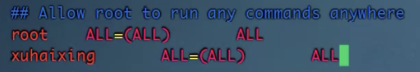
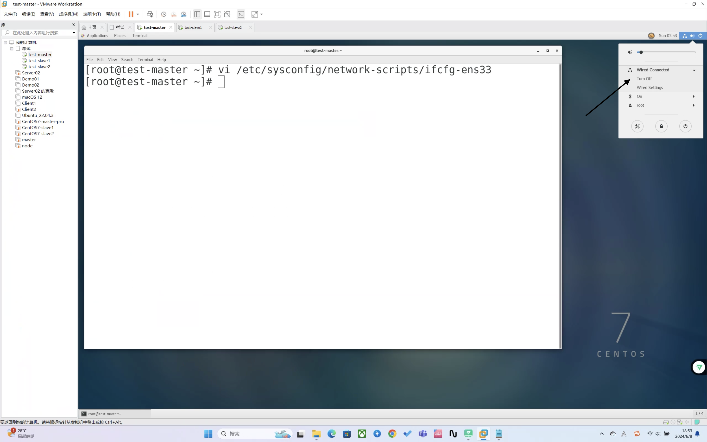
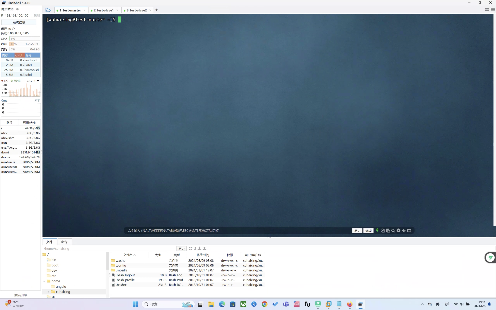

# 考试相关集群配置

<mark>前言</mark>：由于hadoop考试相关要求，使用__指定IP__和__用户__进行操作。本次教程只教各位如何配置IP、同步时区和创建用户。

## 哪些是可以提前做的呢？

1. 创建用户
2. 同步时区
3. 永久关闭防火墙
4. 配置路由
5. 免密登录

<hr />

​	那就开始本次的教程吧！

1. 解压虚拟机`test-master.rar`
2. 打开虚拟机
3. 右键进入控制台
4. 创建用户,我们先用root用户进入`test-master`免去`sudo`命令

```bash
[root@test-master ~]# adduser xuhaixing # 这里是我的用户名，你们可以根据考试要求改成合适的用户名
[root@test-master ~]# passwd xuhaixing # 这里是新创建登录的密码，没有他我们就没办法实验
Changing password for user xuhaixing.
New password:  # 一般来说就设置为123456
BAD PASSWORD: The password is shorter than 8 characters
Retype new password:  # 再次确认
passwd: all authentication tokens updated successfully.
[root@test-master ~]# chmod -v u+w /etc/sudoers # 该文件是只读的，我们修改一下权限
mode of "/etc/sudoers" changed from 0440 (r--r-----) to 0640 (rw-r-----)
[root@test-master ~]# vim /etc/sudoers
# 添加一下内容给予权限
```



```bash
[root@test-master ~]# chmod -v u-w /etc/sudoers # 系统文件，我们把权限改回去
mode of "/etc/sudoers" changed from 0640 (rw-r-----) to 0440 (r--r-----)
```


5. 同步时区

```bash
[root@test-master ~]# ntpdate ntp1.aliyun.com
8 Jun 18:24:41 ntpdate[21224]: step time server 120.25.115.20 offset -28812.747421 sec
```

6. 永久关闭防火墙

```bash
[root@test-master ~]# systemctl stop firewalld.service 
[root@test-master ~]# systemctl disable firewalld.service 
Removed symlink /etc/systemd/system/multi-user.target.wants/firewalld.service.
Removed symlink /etc/systemd/system/dbus-org.fedoraproject.FirewallD1.service.
```

7. 配置路由，使用`vi /etc/hosts`进入`hosts`，配置如下保存退出即可

```bash
127.0.0.1   localhost localhost.localdomain localhost4 localhost4.localdomain4
::1         localhost localhost.localdomain localhost6 localhost6.localdomain6
192.168.100.100 master
192.168.100.101 slave1
192.168.100.102 slave2
```

8. 关机后克隆，我们可以用`poweroff`命令关机

9. 克隆`test-master`虚拟机（使用完整克隆）

10. 三台虚拟机全都开机用root登录，配置静态IP和`hostname`

11. 打开三台虚拟机的控制台输入 `vi /etc/sysconfig/network-scripts/ifcfg-ens33`

    ```sh
    TYPE=Ethernet
    PROXY_METHOD=none
    BROWSER_ONLY=no
    BOOTPROTO=static
    DEFROUTE=yes
    IPV4_FAILURE_FATAL=no
    IPV6INIT=yes
    IPV6_AUTOCONF=yes
    IPV6_DEFROUTE=yes
    IPV6_FAILURE_FATAL=no
    IPV6_ADDR_GEN_MODE=stable-privacy
    NAME=ens33
    UUID=cf87d0bd-48e9-41aa-b65d-a63e65d7ad43
    DEVICE=ens33
    ONBOOT=yes
    IPADDR=192.168.100.100 # 只要改动这里就好了，master是100，slave1是101，slave2是102
    NETMASK=255.255.255.0
    GATEWAY=192.168.100.2
    DNS1=202.101.224.68
    DNS2=202.101.224.69
    ```

    保存退出

    ```bash
    [root@test-master ~]# systemctl restart network
    Job for network.service failed because the control process exited with error code. See "systemctl status network.service" and "journalctl -xe" for details.
    ```

    这里报错了，但是必须得执行不然ip没法更改，然后执行`ifconfig`看看ip更改成功了没。

    然后我们手动在三台机子的图像化页面重启一下网络

    

    

    1. 在控制台输入`vi /etc/hostname`,将里面原有的hostname改为`test-slave1`，`test-slave2`,`master`的hostname不需要更改。更改后在slave1和slave2的机器上用`reboot`命令重启生效

12. 打开`finalshell`连接三台虚拟机，没有的同学可点击下面的链接直接下载：

    > http://www.hostbuf.com/downloads/finalshell_windows_x64.exe

打开`finalshell`连接集群，注意这次登录的用户是你<mark>新创的操作用户</mark>！


看！三台机子的基础配置完成！连接成功！



如有图片无法展示请到gitee中查看：

地址：

> https://gitee.com/haix1ng/LearnToCode

13. 免密登录,在三台机子上都执行这些操作，这里以`master`为例：

    ```bash
    [xuhaixing@test-master ~]$ ssh-keygen -t rsa
    Generating public/private rsa key pair.
    Enter file in which to save the key (/home/xuhaixing/.ssh/id_rsa): 
    Created directory '/home/xuhaixing/.ssh'.
    Enter passphrase (empty for no passphrase): 
    Enter same passphrase again: 
    Your identification has been saved in /home/xuhaixing/.ssh/id_rsa.
    Your public key has been saved in /home/xuhaixing/.ssh/id_rsa.pub.
    The key fingerprint is:
    SHA256:U3yIHGKlweHTdmFMbirNAl/0A6aiImkvYZvQanWVTJY xuhaixing@test-master
    The key's randomart image is:
    +---[RSA 2048]----+
    |     .==Bo+      |
    |     o=E.O.o     |
    |    o =+* X .    |
    | o . +.* = o     |
    |=+o. .+ S        |
    |=o* .  o .       |
    |.= .             |
    |. .              |
    |                 |
    +----[SHA256]-----+
    [xuhaixing@test-master ~]$ ssh-copy-id master
    /usr/bin/ssh-copy-id: INFO: Source of key(s) to be installed: "/home/xuhaixing/.ssh/id_rsa.pub"
    The authenticity of host 'master (192.168.100.100)' can't be established.
    ECDSA key fingerprint is SHA256:px3AN/iw6cG8lTU0ce+Y7dbNQTS5i+IMtIVW1TX+Zww.
    ECDSA key fingerprint is MD5:60:12:c3:38:34:bc:46:8a:70:4b:ed:84:40:a6:50:89.
    Are you sure you want to continue connecting (yes/no)? yes
    /usr/bin/ssh-copy-id: INFO: attempting to log in with the new key(s), to filter out any that are already installed
    /usr/bin/ssh-copy-id: INFO: 1 key(s) remain to be installed -- if you are prompted now it is to install the new keys
    xuhaixing@master's password: 
    
    Number of key(s) added: 1
    
    Now try logging into the machine, with:   "ssh 'master'"
    and check to make sure that only the key(s) you wanted were added.
    
    [xuhaixing@test-master ~]$ ssh-copy-id slave1
    /usr/bin/ssh-copy-id: INFO: Source of key(s) to be installed: "/home/xuhaixing/.ssh/id_rsa.pub"
    The authenticity of host 'slave1 (192.168.100.101)' can't be established.
    ECDSA key fingerprint is SHA256:px3AN/iw6cG8lTU0ce+Y7dbNQTS5i+IMtIVW1TX+Zww.
    ECDSA key fingerprint is MD5:60:12:c3:38:34:bc:46:8a:70:4b:ed:84:40:a6:50:89.
    Are you sure you want to continue connecting (yes/no)? yes
    /usr/bin/ssh-copy-id: INFO: attempting to log in with the new key(s), to filter out any that are already installed
    /usr/bin/ssh-copy-id: INFO: 1 key(s) remain to be installed -- if you are prompted now it is to install the new keys
    xuhaixing@slave1's password: 
    
    Number of key(s) added: 1
    
    Now try logging into the machine, with:   "ssh 'slave1'"
    and check to make sure that only the key(s) you wanted were added.
    
    [xuhaixing@test-master ~]$ ssh-copy-id slave2
    /usr/bin/ssh-copy-id: INFO: Source of key(s) to be installed: "/home/xuhaixing/.ssh/id_rsa.pub"
    The authenticity of host 'slave2 (192.168.100.102)' can't be established.
    ECDSA key fingerprint is SHA256:px3AN/iw6cG8lTU0ce+Y7dbNQTS5i+IMtIVW1TX+Zww.
    ECDSA key fingerprint is MD5:60:12:c3:38:34:bc:46:8a:70:4b:ed:84:40:a6:50:89.
    Are you sure you want to continue connecting (yes/no)? yes
    /usr/bin/ssh-copy-id: INFO: attempting to log in with the new key(s), to filter out any that are already installed
    /usr/bin/ssh-copy-id: INFO: 1 key(s) remain to be installed -- if you are prompted now it is to install the new keys
    xuhaixing@slave2's password: 
    
    Number of key(s) added: 1
    
    Now try logging into the machine, with:   "ssh 'slave2'"
    and check to make sure that only the key(s) you wanted were added.
    ```

到这里基础集群的配置就配置好了！

