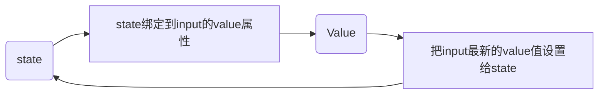

# React受控表单绑定

概念：使用React表单组件的状态（useState）控制表单的状态。



1. 准备一个React状态值

   ```tsx
   const [value, setValue] = useState('')
   ```

   

2. 通过value属性绑定状态，通过onChange属性绑定状态同步的函数

   ```tsx
   <input
     type="text"
     value={value}
     onChange={(e) => setValue(e.target.value)}
     />
   ```

   

```tsx
import React, { useState } from 'react'

// 1.声明一个react状态 - useState

// 2.核心绑定流程
// 1.通过value属性绑定react状态
// 2.绑定onChange事件，通过时间参数e拿到输入框最新的值，反向修改的到react状态

const FormInput = () => {
    const [value, setValue] = useState('')
    return (
        <div>
            <input
                value={value}
                onChange={(e) => { setValue(e.target.value) }}
                type='text'
            />
        </div>
    )
}

export default FormInput
```

