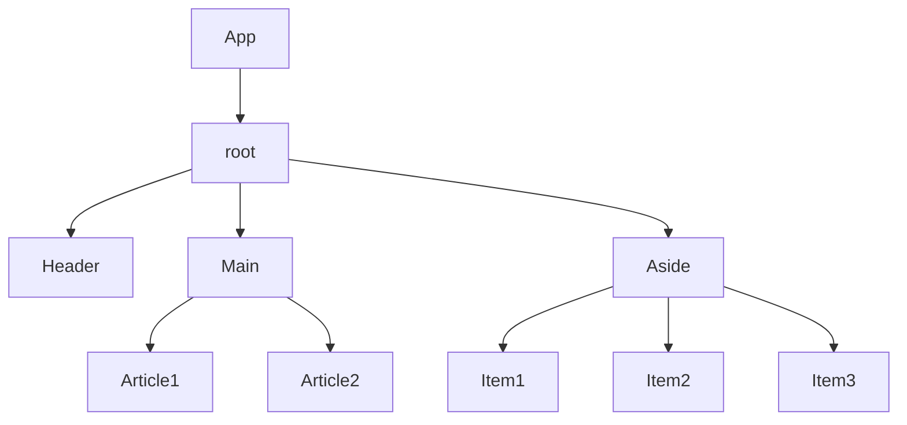

# React组件基础使用

### 组件是什么？

概念：一个组件是就是用户界面的一部分，它可以有自己的逻辑和外观，组件之间__可以相互嵌套，也可以复用多次。__



组件化开发可以让开发人员像搭积木一样构建一个完整的庞大的应用。

### React组件

​	在React中，一个组件就是__首字母大写的函数__，内部存放了组件的逻辑和视图UI，渲染组件只需要把组件__当成标签书写__即可。

```react
// 1.定义组件
function Button() {
  // 组件内部逻辑
  return <button>click me!</button>
}

export default Button
```

```react
function App() {
  // 2.使用组件
  return (
  	<div>
      {/* 自闭和 */}
    	<Button />
      {/* 成对标签 */}
      <Button></Button>
    </div>
  )
}

export default App
```

