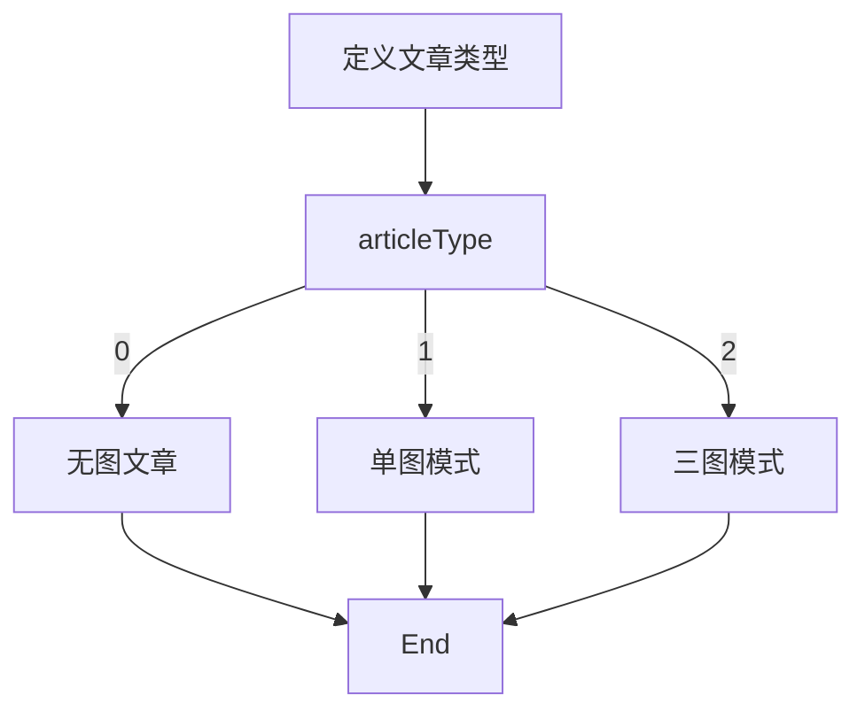

# jsx实现复杂条件渲染



```tsx
import React from 'react'

const articleType = 0 // 0 1 2

function getArticleTem() {
    if (articleType === 0) {
        return <div>我是无图模式</div>
    }else if(articleType === 1) {
        return <div>我是单图模式</div>
    }else if(articleType === 2) {
        return <div>我是三图模式</div>
    }else {
        return <div>loading...</div>
    }
}

const ComplexConditions = () => {
  return (
    <div>{getArticleTem()}</div>
  )
}

export default ComplexConditions
```

当然这种比较是无意义的，但是放在后期的网页动态渲染是经常用到的。
