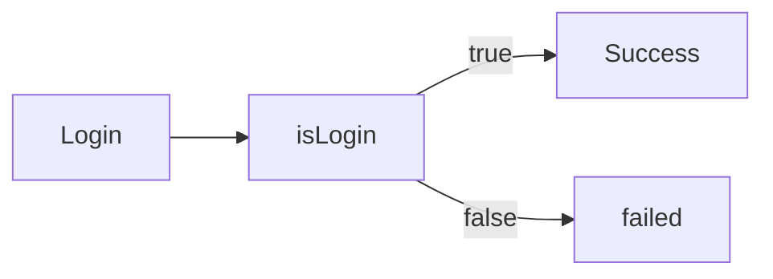

# jsx实现条件渲染



语法：在React中可以通过__逻辑运算符和三元运算符__实现基本的条件渲染。

```react
import React from 'react'

const isLogin = true

const Condition = () => {
  return (
    <>
        {/* 逻辑与 && */}
        {isLogin && <span>this is span!</span>}
        {/* 三元运算 */}
        {isLogin ? <span>Hello Kato Megumi!</span> : <span>loading...</span>}
    </>
  )
}

export default Condition
```

这样当isLogin为true的时候，页面将显示this is span!Hello Kato Megumi!。