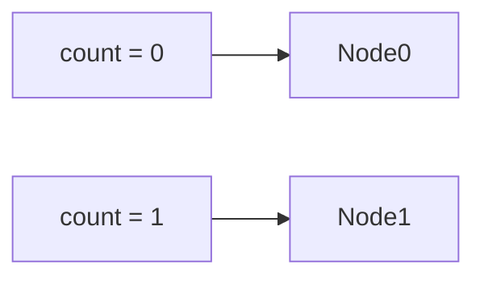

# useState基础使用

useState是一个React Hooks(函数)，它允许我们向组件添加一个__状态变量__，从而控制影响组件的渲染结果。



本质：和普通JS变量不同的是，状态变量一旦发生变化组件UI也会跟着变化（_数据驱动视图_）。

```react
import React, { useState } from 'react'

const UseState = () => {
    // 1.调用useState添加一个状态变量
    // count 状态变量
    // setCount 修改状态变量的方法
    const [count, setCount] = useState(0)
    // 2.点击事件回调
    const handleClick = () => {
        // 作用：1.用传入的新值修改count
        // 2.重新使用新的count渲染UI
        setCount(count + 1)
    }

    return (
        <>
            <button onClick={handleClick}>点我加1</button>
            <span>&nbsp;我被点了：{count}下</span>
        </>
    )
}

export default UseState
```


