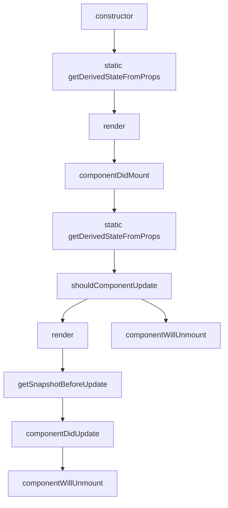

# 为什么选择React?

__React是一个JavaScript库，用于构建动态和交互式用户界面__，它于2011年在Facebook创建，并且是目前广泛用于前端开发的JavaScript库。随着应用的增长，使用dom可能会变得相当复杂，管理起来也很有挑战性，这就是React发挥作用的地方，使用React我们将不再需要担心查询和更新dom元素。相反，React可以构建可重复使用的小组件来实现组件构成的web页面，这样让我们的工作变得更加轻松。


## React的本质是什么？

本质上，React应用程序是一个组件树，应用程序是根

### 构建和使用React

```bash
npm create vite@4.1.0
cd react-app
npm install # 或者npm i
npm run dev
```

### React项目目录结构

一般来说，React库中有三个主要的文件夹，分别是node_modules、public、src。它们存放的东西各不相同，node_modules里面存放的都是第三方库，public存放的都是web公共资源，src则是项目的源文件夹。 

#### React生命周期



### React的库和框架的区别

我们已经知道了React是一个Javascript库，对比React来说其他的比如Angluar和Vue它们是框架，但是库和框架的区别是什么？

库是提供特定功能的工具， 而框架提供了一套工具以及一个用来创建程序的规范。 

所以库像工具，而框架则像是工具套件。

React只是一个用来创建用户界面的库或者工具。`

