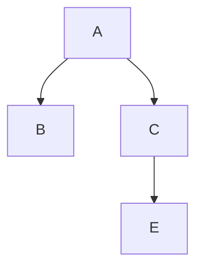

# 组件通信-父传子

概念：组件通信就是__组件之间的数据传递__，根据组件嵌套关系的不同，有不同的通信方法。



A-B父子通信	B-C兄弟通信	A-E跨层通信

### 实现步骤

1. 父组件传递数据 - 在子组件标签上绑定属性
2. 子组件接收数据 - 子组件通过props参数接收数据

父组件：

```tsx
import { useState } from "react";
import Son from "./components/Son";

function App() {
  const name = "this is app name."

  return (
    <>
      <Son name={name} />
    </>
  );
}

export default App;
```

子组件：

```tsx
import React from 'react'

const Son = (props: any) => {
    console.log(props)

    return (
        <div>This is Son! {props.name}</div>
    )
}

export default Son
```

### 父传子-props说明

1. props可以传递任意数据

   ​	数字、字符串、布尔值、数组、对象、函数、JSX。

2. props是只读对象

   ​	子组件只能读取props中的数据，不能直接进行修改，只能通过父组件修改。

### 父传子-特殊的props children

场景：当我们把内容嵌套在子组件标签中，父组件会自动在名为children的prop属性中接收该内容。