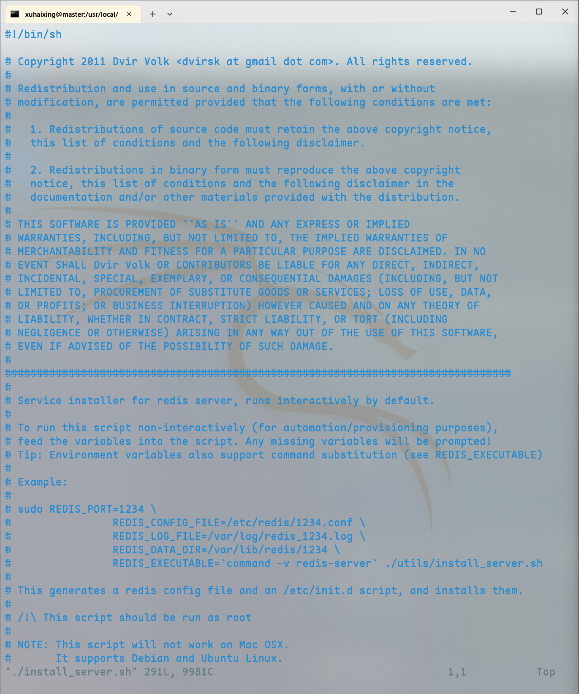
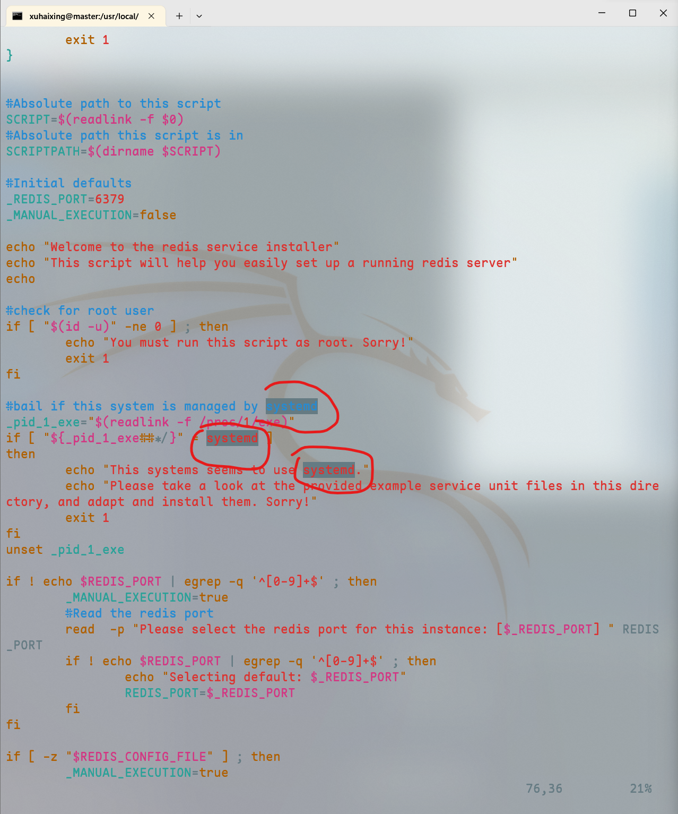

# Redis的安装

本小节的内容是Redis的安装，如果不会的同学可以跟着我一起做。

本次使用的虚拟机为CentOS7

也就是欧阳潘老师让我们安装的哪个虚拟机，我这里以master为示例：

那么就跟我一起进入正题吧！

1. 获取安装包

    我们可以去Redis的官网下载老师要求的版本redis-7.2.4，地址我放在下面了

> https://redis.io/download/

还记得我们这个master主机配置过了ftp吗？

我们现在使用它，打开文件资源管理器，在地址栏输入`ftp://x.x.x.x`将下载好的`redis`安装包复制进pub文件夹

然后我们可以用`finalshell`远程连接我们的master主机


2. 解压Redis

```bash
[xuhaixing@master ~]$ cd /usr/local/
[xuhaixing@master local]$ sudo mkdir redis
[sudo] password for xuhaixing:
[xuhaixing@master local]$ cd redis/
[xuhaixing@master redis]$ sudo tar -zxvf /var/ftp/pub/redis-7.2.4.tar.gz -C /usr/local/redis/
# 省略解压的文件内容
[xuhaixing@master redis]$ ll
total 4
drwxrwxr-x. 8 root root 4096 Jan  9 19:51 redis-7.2.4
```

3. 检查C语言环境

```bash
[xuhaixing@master redis]$ gcc -v
bash: gcc: command not found...
```

可以看到，我们的master主机上是没有C语言环境的，让我们安装一下gcc

```bash
[xuhaixing@master redis]$ sudo yum install -y gcc
Loaded plugins: fastestmirror, langpacks
Loading mirror speeds from cached hostfile
 * base: mirrors.ustc.edu.cn
 * extras: mirrors.huaweicloud.com
 * updates: mirrors.163.com
base                                                                           | 3.6 kB  00:00:00
docker-ce-stable                                                               | 3.5 kB  00:00:00
extras                                                                         | 2.9 kB  00:00:00
updates                                                                        | 2.9 kB  00:00:00
Resolving Dependencies
--> Running transaction check
---> Package gcc.x86_64 0:4.8.5-44.el7 will be installed
--> Processing Dependency: cpp = 4.8.5-44.el7 for package: gcc-4.8.5-44.el7.x86_64
--> Processing Dependency: glibc-devel >= 2.2.90-12 for package: gcc-4.8.5-44.el7.x86_64
--> Running transaction check
---> Package cpp.x86_64 0:4.8.5-44.el7 will be installed
---> Package glibc-devel.x86_64 0:2.17-326.el7_9 will be installed
--> Processing Dependency: glibc-headers = 2.17-326.el7_9 for package: glibc-devel-2.17-326.el7_9.x86_64
--> Processing Dependency: glibc = 2.17-326.el7_9 for package: glibc-devel-2.17-326.el7_9.x86_64
--> Processing Dependency: glibc-headers for package: glibc-devel-2.17-326.el7_9.x86_64
--> Running transaction check
---> Package glibc.x86_64 0:2.17-317.el7 will be updated
--> Processing Dependency: glibc = 2.17-317.el7 for package: glibc-common-2.17-317.el7.x86_64
---> Package glibc.x86_64 0:2.17-326.el7_9 will be an update
---> Package glibc-headers.x86_64 0:2.17-326.el7_9 will be installed
--> Processing Dependency: kernel-headers >= 2.2.1 for package: glibc-headers-2.17-326.el7_9.x86_64
--> Processing Dependency: kernel-headers for package: glibc-headers-2.17-326.el7_9.x86_64
--> Running transaction check
---> Package glibc-common.x86_64 0:2.17-317.el7 will be updated
---> Package glibc-common.x86_64 0:2.17-326.el7_9 will be an update
---> Package kernel-headers.x86_64 0:3.10.0-1160.108.1.el7 will be installed
--> Finished Dependency Resolution

Dependencies Resolved

======================================================================================================
 Package                  Arch             Version                            Repository         Size
======================================================================================================
Installing:
 gcc                      x86_64           4.8.5-44.el7                       base               16 M
Installing for dependencies:
 cpp                      x86_64           4.8.5-44.el7                       base              5.9 M
 glibc-devel              x86_64           2.17-326.el7_9                     updates           1.1 M
 glibc-headers            x86_64           2.17-326.el7_9                     updates           691 k
 kernel-headers           x86_64           3.10.0-1160.108.1.el7              updates           9.1 M
Updating for dependencies:
 glibc                    x86_64           2.17-326.el7_9                     updates           3.6 M
 glibc-common             x86_64           2.17-326.el7_9                     updates            12 M

Transaction Summary
======================================================================================================
Install  1 Package  (+4 Dependent packages)
Upgrade             ( 2 Dependent packages)

Total size: 48 M
Total download size: 33 M
Downloading packages:
(1/5): glibc-devel-2.17-326.el7_9.x86_64.rpm                                   | 1.1 MB  00:00:00
(2/5): cpp-4.8.5-44.el7.x86_64.rpm                                             | 5.9 MB  00:00:01
(3/5): glibc-headers-2.17-326.el7_9.x86_64.rpm                                 | 691 kB  00:00:01
(4/5): kernel-headers-3.10.0-1160.108.1.el7.x86_64.rpm                         | 9.1 MB  00:00:01
(5/5): gcc-4.8.5-44.el7.x86_64.rpm   68% [=================-        ] 1.0 MB/s |  22 MB (5/5): gcc-4.8.5-44.el7.x86_64.rpm   68% [=================-        ] 967 kB/s |  23 MB (5/5): gcc-4.8.5-44.el7.x86_64.rpm   68% [=================-        ] 934 kB/s |  23 MB (5/5): gcc-4.8.5-44.el7.x86_64.rpm                               |  16 MB  00:00:35
----------------------------------------------------------------------------------------
Total                                                      963 kB/s |  33 MB  00:35
Running transaction check
Running transaction test
Transaction test succeeded
Running transaction
  Updating   : glibc-2.17-326.el7_9.x86_64                                          1/9
  Updating   : glibc-common-2.17-326.el7_9.x86_64                                   2/9
  Installing : cpp-4.8.5-44.el7.x86_64                                              3/9
  Installing : kernel-headers-3.10.0-1160.108.1.el7.x86_64                          4/9
  Installing : glibc-headers-2.17-326.el7_9.x86_64                                  5/9
  Installing : glibc-devel-2.17-326.el7_9.x86_64                                    6/9
  Installing : gcc-4.8.5-44.el7.x86_64                                              7/9
  Cleanup    : glibc-2.17-317.el7.x86_64                                            8/9
  Cleanup    : glibc-common-2.17-317.el7.x86_64                                     9/9
  Verifying  : glibc-common-2.17-326.el7_9.x86_64                                   1/9
  Verifying  : glibc-2.17-326.el7_9.x86_64                                          2/9
  Verifying  : kernel-headers-3.10.0-1160.108.1.el7.x86_64                          3/9
  Verifying  : glibc-devel-2.17-326.el7_9.x86_64                                    4/9
  Verifying  : cpp-4.8.5-44.el7.x86_64                                              5/9
  Verifying  : glibc-headers-2.17-326.el7_9.x86_64                                  6/9
  Verifying  : gcc-4.8.5-44.el7.x86_64                                              7/9
  Verifying  : glibc-2.17-317.el7.x86_64                                            8/9
  Verifying  : glibc-common-2.17-317.el7.x86_64                                     9/9

Installed:
  gcc.x86_64 0:4.8.5-44.el7

Dependency Installed:
  cpp.x86_64 0:4.8.5-44.el7              glibc-devel.x86_64 0:2.17-326.el7_9
  glibc-headers.x86_64 0:2.17-326.el7_9  kernel-headers.x86_64 0:3.10.0-1160.108.1.el7

Dependency Updated:
  glibc.x86_64 0:2.17-326.el7_9           glibc-common.x86_64 0:2.17-326.el7_9

Complete!
[xuhaixing@master redis]$ gcc -v
Using built-in specs.
COLLECT_GCC=gcc
COLLECT_LTO_WRAPPER=/usr/libexec/gcc/x86_64-redhat-linux/4.8.5/lto-wrapper
Target: x86_64-redhat-linux
Configured with: ../configure --prefix=/usr --mandir=/usr/share/man --infodir=/usr/share/info --with-bugurl=http://bugzilla.redhat.com/bugzilla --enable-bootstrap --enable-shared --enable-threads=posix --enable-checking=release --with-system-zlib --enable-__cxa_atexit --disable-libunwind-exceptions --enable-gnu-unique-object --enable-linker-build-id --with-linker-hash-style=gnu --enable-languages=c,c++,objc,obj-c++,java,fortran,ada,go,lto --enable-plugin --enable-initfini-array --disable-libgcj --with-isl=/builddir/build/BUILD/gcc-4.8.5-20150702/obj-x86_64-redhat-linux/isl-install --with-cloog=/builddir/build/BUILD/gcc-4.8.5-20150702/obj-x86_64-redhat-linux/cloog-install --enable-gnu-indirect-function --with-tune=generic --with-arch_32=x86-64 --build=x86_64-redhat-linux
Thread model: posix
gcc version 4.8.5 20150623 (Red Hat 4.8.5-44) (GCC)
```

这样我们的C语言环境就配置成功了。


4. 安装和配置Redis

```bash
[xuhaixing@master redis]$ cd redis-7.2.4/
[xuhaixing@master redis-7.2.4]$ sudo make&&sudo make install
# 省略编译的一些过程和加载项
[xuhaixing@master redis-7.2.4]$ cd utils/
[xuhaixing@master utils]$ ll
total 120
-rw-rw-r--. 1 root root   593 Jan  9 19:51 build-static-symbols.tcl
-rw-rw-r--. 1 root root  1303 Jan  9 19:51 cluster_fail_time.tcl
-rw-rw-r--. 1 root root  1098 Jan  9 19:51 corrupt_rdb.c
drwxrwxr-x. 2 root root    60 Jan  9 19:51 create-cluster
-rwxrwxr-x. 1 root root 22087 Jan  9 19:51 generate-command-code.py
-rwxrwxr-x. 1 root root  5025 Jan  9 19:51 generate-commands-json.py
-rwxrwxr-x. 1 root root  6747 Jan  9 19:51 generate-module-api-doc.rb
-rwxrwxr-x. 1 root root  1813 Jan  9 19:51 gen-test-certs.sh
drwxrwxr-x. 3 root root    31 Jan  9 19:51 graphs
drwxrwxr-x. 2 root root    70 Jan  9 19:51 hyperloglog
-rwxrwxr-x. 1 root root  9981 Jan  9 19:51 install_server.sh
drwxrwxr-x. 2 root root    63 Jan  9 19:51 lru
-rw-rw-r--. 1 root root  1277 Jan  9 19:51 redis-copy.rb
-rwxrwxr-x. 1 root root  1352 Jan  9 19:51 redis_init_script
-rwxrwxr-x. 1 root root  1047 Jan  9 19:51 redis_init_script.tpl
-rw-rw-r--. 1 root root  1763 Jan  9 19:51 redis-sha1.rb
drwxrwxr-x. 2 root root   135 Jan  9 19:51 releasetools
-rw-rw-r--. 1 root root   953 Jan  9 19:51 reply_schema_linter.js
-rwxrwxr-x. 1 root root 12059 Jan  9 19:51 req-res-log-validator.py
drwxrwxr-x. 2 root root    30 Jan  9 19:51 req-res-validator
-rwxrwxr-x. 1 root root  3787 Jan  9 19:51 speed-regression.tcl
drwxrwxr-x. 2 root root    61 Jan  9 19:51 srandmember
-rw-rw-r--. 1 root root  1310 Jan  9 19:51 systemd-redis_multiple_servers@.service
-rw-rw-r--. 1 root root  1550 Jan  9 19:51 systemd-redis_server.service
-rw-rw-r--. 1 root root  2273 Jan  9 19:51 tracking_collisions.c
-rwxrwxr-x. 1 root root   694 Jan  9 19:51 whatisdoing.sh
[xuhaixing@master utils]$ sudo ./install_server.sh
Welcome to the redis service installer
This script will help you easily set up a running redis server

This systems seems to use systemd.
Please take a look at the provided example service unit files in this directory, and adapt and install them. Sorry!
# 看到这个运行不了这个sh的同学不用担心，这是我故意的
```

大家可以看到，运行`sudo ./install_server.sh`的时候提示了：

This systems seems to use systemd.
Please take a look at the provided example service unit files in this directory, and adapt and install them. Sorry!

这是为什么呢？

因为：__使用`install_server.sh`脚本安装Redis服务器，但是脚本检测到你的系统使用`systemd`作为服务管理器__，我们可以修改脚本里的配置文件。

如果不熟悉vim的同学请跟着我一步一步来哦~

```bash
[xuhaixing@master utils]$ sudo vim ./install_server.sh
[sudo] password for xuhaixing:
```




我们看到了这个页面，我们先什么都不按，

我们可以找查里面的关键字`systemd`

怎么做呢？先输入`/`然后输入`systemd`然后按`Enter`就可以跳转到对应的关键字上了



我们把这一段注释掉

```sh
#bail if this system is managed by systemd
# _pid_1_exe="$(readlink -f /proc/1/exe)"
# if [ "${_pid_1_exe##*/}" = systemd ]
# then
#         echo "This systems seems to use systemd."
#         echo "Please take a look at the provided example service unit files in this directory, and adapt and install them. Sorry!"
#         exit 1
# fi
```

保存并退出！

再执行一次

```bash
[xuhaixing@master utils]$ sudo ./install_server.sh
[sudo] password for xuhaixing:
Welcome to the redis service installer
This script will help you easily set up a running redis server

Please select the redis port for this instance: [6379]
Selecting default: 6379
Please select the redis config file name [/etc/redis/6379.conf] # 回车
Selected default - /etc/redis/6379.conf
Please select the redis log file name [/var/log/redis_6379.log] # 回车
Selected default - /var/log/redis_6379.log
Please select the data directory for this instance [/var/lib/redis/6379] # 回车
Selected default - /var/lib/redis/6379
Please select the redis executable path [] /usr/local/bin/redis-server # 这里输入一下路径
Selected config:
Port           : 6379
Config file    : /etc/redis/6379.conf
Log file       : /var/log/redis_6379.log
Data dir       : /var/lib/redis/6379
Executable     : /usr/local/bin/redis-server
Cli Executable : /usr/local/bin/redis-cli
```

这样，我们就配置好了redis，我们现在启动一下它吧！


5. 启动redis

```bash
[xuhaixing@master utils]$ redis-cli
127.0.0.1:6379> ping
PONG
127.0.0.1:6379> exit
[xuhaixing@master utils]$
```

这样我们的`Redis`就安装好了！

同学们，你们成功了吗？:happy:

