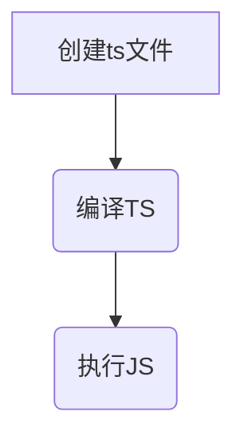

# 2.TypeScript初体验

## 2.1 安装编译TS的工具包

问题: 为什么要安装编译TS工具包?

回答: Node.js/浏览器,只认识JS代码,不认识TS代码.需要先将TS代码转化为JS代码,然后才能运行.

安装命令:

> npm i -g typescript

typescript包: 用来编译TS代码的包,提供了tsc命令,实现了TS->JS的转化.

验证是否安装成功: `tsc -v`(查看typescript的版本).

## 2.2 编译并运行TS代码

1. 创建hello.ts文件(注意: TS文件的后缀名为`.ts`)

2. 将TS编译为JS: 在终端输入命令,tsc hello.ts(此时,在同级目录中会出现一个同名的JS文件).

3. 执行JS代码: 在终端中输入命令, node hello.js

    

说明: `所有合法`的JS代码都是TS代码,有JS基础只需要学习`TS的类型`即可.

__注意: 由TS编译生成的JS文件,代码中就`没有类型信息`了.__

## 2.3 简化运行TS的步骤

问题描述: 每次修改代码后,都需要重复执行两个命令,才能执行TS代码,太繁琐.

简化方式: 使用`ts-node`包,直接在Node.js中执行TS代码.

安装命令:

> npm i -g ts-node (ts-node包提供了ts-node命令).

使用方式: `ts-node file.ts`

解释: ts-node命令在内部偷偷的将TS->JS.然后,再运行JS代码.